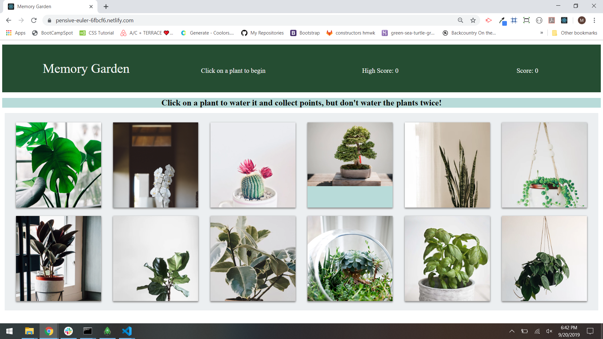

# Memory Garden

A game built in React.js. Can you water all twelve plants without clicking on the same plant twice?

*Due to a file structure issue, most of this app was built in my "clicky-game" repository and then cloned into this repository.* 

# Instructions

After cloning the repository, run npm i

Then, run npm start

# Tech

React 

